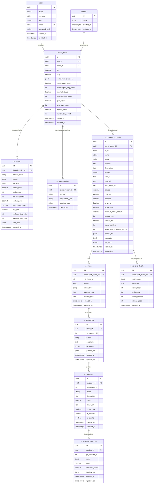

# VoC Detailed Database ER Diagram

```mermaid
erDiagram
    users ||--o{ brand_feeder : "manages"
    brands ||--o{ brand_feeder : "requested for"
    
    brand_feeder ||--o{ ys_listing : "generates listing"
    brand_feeder ||--o{ ys_autocomplete : "generates suggestions"
    brand_feeder ||--o{ ys_restaurants_details : "detailed scrape"

    ys_restaurants_details ||--o{ ys_menus : "has"
    ys_menus ||--o{ ys_categories : "categorizes"
    ys_categories ||--o{ ys_products : "contains"
    ys_products ||--o{ ys_product_variations : "has variations"
    ys_restaurants_details ||--o{ ys_reviews_details : "receives reviews"

    users {
        uuid id PK
        string name
        string surname
        string role
        string email UK
        string password_hash
        timestamptz created_at
        timestamptz updated_at
    }

    brands {
        uuid id PK
        string name
        timestamptz created_at
        timestamptz updated_at
    }

    brand_feeder {
        uuid id PK
        uuid user_id FK
        uuid brand_id FK
        decimal lat
        decimal long
        jsonb competition_brand_ids
        boolean yemeksepeti_status
        int yemeksepeti_retry_count
        boolean trendyol_status
        int trendyol_retry_count
        boolean getir_status
        int getir_retry_count
        boolean migros_status
        int migros_retry_count
        timestamptz created_at
        timestamptz updated_at
    }

    ys_listing {
        uuid id PK
        uuid brand_feeder_id FK
        string vendor_code
        string name
        string url_key
        decimal rating_value
        int rating_count
        int distance_meters
        decimal delivery_fee
        decimal min_order_value
        boolean is_open
        int delivery_time_min
        int delivery_time_max
        jsonb raw_data
        timestamptz created_at
    }

    ys_autocomplete {
        uuid id PK
        uuid brand_feeder_id FK
        string keyword
        string suggestion_type
        string tracking_code
        timestamptz created_at
    }

    ys_restaurants_details {
        uuid id PK
        uuid brand_feeder_id FK
        string ys_id
        string name
        string phone
        text address
        text description
        string url_key
        text web_url
        text logo_url
        text hero_image_url
        decimal latitude
        decimal longitude
        decimal distance
        boolean is_active
        boolean is_premium
        decimal minimum_order_amount
        int budget_level
        decimal service_fee
        int review_number
        int review_with_comment_number
        jsonb vertical_info
        jsonb metadata
        jsonb raw_data
        timestamptz created_at
        timestamptz updated_at
    }

    ys_menus {
        uuid id PK
        uuid restaurant_details_id FK
        int ys_menu_id
        string name
        string menu_type
        time opening_time
        time closing_time
        timestamptz created_at
        timestamptz updated_at
    }

    ys_categories {
        uuid id PK
        uuid menu_id FK
        int ys_category_id
        string name
        text description
        boolean is_popular
        jsonb partner_info
        timestamptz created_at
        timestamptz updated_at
    }

    ys_products {
        uuid id PK
        uuid category_id FK
        int ys_product_id
        string name
        text description
        decimal price
        text image_url
        boolean is_sold_out
        boolean is_alcoholic
        boolean is_bundle
        timestamptz created_at
        timestamptz updated_at
    }

    ys_product_variations {
        uuid id PK
        uuid product_id FK
        int ys_variation_id
        string name
        decimal price
        decimal container_price
        jsonb topping_ids
        timestamptz created_at
        timestamptz updated_at
    }

    ys_reviews_details {
        uuid id PK
        uuid restaurant_details_id FK
        string user_name
        text comment
        int rating_total
        int rating_flavor
        int rating_service
        int rating_speed
        timestamptz created_at
    }
```
